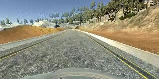

[//]: # (Image References)

[model_plot]: output_images/model_plot.png

[augmentations0]: output_images/1_cropped_center_2016_12_01_13_33_05_396.png

[augmentations1]: output_images/1_cropped_center_2016_12_01_13_32_45_578.png

[augmentations2]: output_images/1_cropped_center_2016_12_01_13_33_57_010.png

[steering_data]: output_images/1_steerings_data.png
[triple_view]: output_images/1_three_views_data.png
[steering_angles]: output_images/1_steering_histogram.png

# Behavioral Cloning Project

Overview
---

Deep network for learning to drive a course

| Course  | Reverse course |
|---|---|
|  | 

# Project Specifications

## Criteria
---
| Topic  | CRITERIA   | MEETS SPECIFICATIONS |
|---|---|---|
|Required Files | Are all required files submitted? | The submission includes a model.py file, drive.py, model.h5 a writeup report and video.mp4.   |
| Quality of Code  | Is the code functional?  | The model provided can be used to successfully operate the simulation.  |
| Quality of Code  | Is the code usable and readable?  | The code in model.py uses a Python generator, if needed, to generate data for training rather than storing the training data in memory. The model.py code is clearly organized and comments are included where needed. |
| Model Architecture and Training Strategy  | Has an appropriate model architecture been employed for the task? |The neural network uses convolution layers with appropriate filter sizes. Layers exist to introduce nonlinearity into the model. The data is normalized in the model.  | 
| Model Architecture and Training Strategy  | Has an attempt been made to reduce overfitting of the model?  | Train/validation/test splits have been used, and the model uses dropout layers or other methods to reduce overfitting.  |
| Model Architecture and Training Strategy  | Have the model parameters been tuned appropriately?  |Learning rate parameters are chosen with explanation, or an Adam optimizer is used.   |
| Model Architecture and Training Strategy  | Is the training data chosen appropriately?  | Training data has been chosen to induce the desired behavior in the simulation (i.e. keeping the car on the track). |
| Architecture and Training Documentation  | Is the solution design documented?  | The README thoroughly discusses the approach taken for deriving and designing a model architecture fit for solving the given problem.   |
| Architecture and Training Documentation  | Is the model architecture documented?  | The README provides sufficient details of the characteristics and qualities of the architecture, such as the type of model used, the number of layers, the size of each layer. Visualizations emphasizing particular qualities of the architecture are encouraged.  |
| Architecture and Training Documentation  | Is the creation of the training dataset and training process documented? |  The README describes how the model was trained and what the characteristics of the dataset are. Information such as how the dataset was generated and examples of images from the dataset must be included. |
| Simulation | Is the car able to navigate correctly on test data?  | No tire may leave the drivable portion of the track surface. The car may not pop up onto ledges or roll over any surfaces that would otherwise be considered unsafe (if humans were in the vehicle). |

## Details About Files In This Directory

| file | description  | 
| :-----: | :-------------------: |
| model.py | script used to create and train the model |
| drive.py | script to drive the car |
| data_server/generator.py | data serving - loading, augmenting and batch generation |
| model.h5 | the trained Keras model |
| readme.md | report |
| video.mp4 | a few laps around the course |
| video_reverse_course.mp4 | a few laps |
| recovery.mp4 | recovery from being on the sidelines with outward angle |
| recovery2.mp4 | recovery from being half outside the course |

# Project code

### Usage

### Training

    python3 model.py 

There are additional models, such as Nvidia and DenseNet that can be called as:

    python3 model.py densenet
    python3 model.py nvidia

### Autonomous mode

Run the drive sequence with the matching model:

	python3 drive.py model.h5

## Code details

*  data_server/generator.py

The data generator inherits from Keras' Sequence class, designed for data serving. In order to use the class, two methods, namely, __len__ & __getitem__ needed to be implemented:

    class DataGenerator(keras.utils.Sequence):
		def __len__(self):
			...

		def __getitem__(self, index):
			...

* model.py

Straight forward usage - build the model (Final model uses the Sequential API), compile and serve through Keras' fit_generator() API

* trace.py

Used for multithreading debuging

* drive.py

Use for autonomous mode

# Model Architecture and Training Strategy

The goal was building a model that sucessfully drives continuously, while reducing model size as much as possible.

Final model size is 1.8 MB

The code uses a straight forward deep architecture with repeating blocks.

## Repeated block

Each block is composed of:

1. 2D Convolution, 3 channels, 1x1 convolution, ReLU activation

2. 2D Convolution block

	2.1. 2D Convolution - 8 channels, 3x3 convolution

	2.2. Batch normalization

	2.3. Relu activation

3. 2D Convolution block

	3.1. 2D Convolution - 8 channels, 3x3 convolution

	3.2. Batch normalization

	3.3. Relu activation

4. 2D Convolution - 8 channels, 1x1 convolution

5. Max pooling 2D, 2x2 strides

## Model architecture

1. Image normalization in the [-1, 1] range

2. Image cropping (Y axis)

3. A-parametric 1x1, 3 channels colorspace transformation

4. Block repetition x3 (3 convolutions and maxpooling)

5. Fully connected 

    5.1. Flatten, 

	5.2. Consecutive dense ReLU layers of sizes 64, 32, 16

	5.3. Output dense ReLU layer of size 1

![model_plot][model_plot]

## Overfitting & regularization

Overfitting has been met with 

1. Batch normalization for the convolutional layers (BN does not work well with Dropout and thus dropout has been left out)

2. Weight regularization - L2 regularization for the Dense layers. Weights have been tested on various scales (10 to the minus -1 to -5) and a standard value of 10 to the -3 have been selected as a minimum error value for the (final) validation error.

## Tuning

* Learning rate has been input into the Adam optimizer

* Epochs - raise between 3 and 15 and set to 10. After 10, the vehicle wobbling increases and thus, assuming overfitting occures, which makes performance degredation in the simulator. 

* Model - several models have been tested (see Notes), but all have yielded similar results and thus, smallest model has been chosen.

## Data 

### Data recordings

Data recording were taken as:

1. Two around the course driving (> 1 loop)

2. One in the reverse course (> 1 loop)

3. A few recovery drives (from the sidelines back to center)

### Data quality

Data quality is at utmost importance, more than the specific architecture that is being used. 
Thus, the fact that a keyboard is used causes a degredation in the quality of data. The keyboard inserts large angles followed by 0 degrees angles. To overcome the non-contiuous steering angles, that can be seen in the figure below for the three cameras, a centeral-based averaging has been employed to smooth out the angle. 

Under driving.py, due to real time and in order to react quickly, the angle averaging window size is 2, averaging current and previous steering angle.

![steering_data]steering_data

### Data characteristics

Three images per view. In order to utilize the side images, the original value of 0.2 has been found to yield stable results. Had it been tuned, it had been tuned according to the distance between images, which can be found via image registration techniques and a (pixel-wise) distance to a point in front of the car, or numerically tuned.

The three views were plotted with the matching steering angle:

![triple_view][triple_view]

### Data balance

Two histograms and a curve proportional to the PDF (probability density function) of the steering angles are shown:

1. Raw data steering angle histogram

2. Raw data after diluting the over-sampled steering angles. 

It can be seen in the lower curve, that the three over-populated angles were subdued, creating a more subtle curve.

![steering_angles]steering_angles

The dilution still kept a little more of the 0-ed angled images, as most of the time the steering angle is around 0 and this would give extra samples for fine tuning the behaviour around the 0 degrees steering angle.

### Data augmentation

Several data augmentation have been employed. Every augmentation augments the steering angle according to the transformation

1. Oversampling

	Over sampling about steering angles larger that have lower representation in the raw image population. This oversampling just duplicates those images, which may result in overfitting and thus grows the importance of overfitting countermeasures.

1. Translation

	This creates samples similar to the left and right cameras. This allows reaching extreme images that were not in the original raw image population.

	1.1. Translate an image sampled from the general population

	1.2. Translate an image sampled from the samples that have been diluted out of the original raw data population

2. Flip an image

	About the y axis (middle of image), left to right

3. Shear an image

	On top of the translation, this creates new deformations to the images.

	An angle was randomly (uniform) selected and from it the dx shear distance has been calculated

4. Occlusions

	A human is able to follow a road even if the left/right half is hidden. Thus, half of an image has been masked out according to the steering angle, such that only half the data is available for training.

Example 0 
---
![augmentations0]

Example 1
---

![augmentations1]

Example 2
---

![augmentations2]

# Results

The vehicle was tested with speed of 15

As shown in the begining

1. Course 

[video.mp4](video.mp4)

2. Reverse course 

[video_reverse_course.mp4](video_reverse_course.mp4)

3. Recovery #1

[recovery](recovery.mp4)

4. Recovery #2

[recovery](recovery2.mp4)

# Conclusions

The network successfully trained and is able to drive through the course through numerous laps. In this project, several architectures were tested, but it all comes down to the quality of the data. One major drawback of the simulator is the keboard usage which introduces zero degree steering angles, which is data that is not used after dilution. 

The vehicle sucessfully runs in two directions of the course and is also able to find its way out of large angled and extreme positions.

# Notes

Additional architectures were tested

- Nvidia model
- DenseNet
- Shallow-er deep network

Not much variability has been found and similar results between all, considering model size - lowest model size has been taken.

# References

[1] [cropping](https://stackoverflow.com/questions/41925765/keras-cropping2d-changes-color-channel)

[2] [Idea for shear](https://github.com/ctsuu/Behavioral-Cloning/tree/0dc191987c0dc07bc7f116c18be3c7f9bb8a101f) - another Udacity project

[3] [BatchNormalization - optimal usage](https://stackoverflow.com/questions/34716454/where-do-i-call-the-batchnormalization-function-in-keras)

[4] [Nvidia model](https://images.nvidia.com/content/tegra/automotive/images/2016/solutions/pdf/end-to-end-dl-using-px.pdf)

[5] [DenseNet](https://github.com/flyyufelix/DenseNet-Keras)

[6] [DenstNet #1](https://towardsdatascience.com/densenet-2810936aeebb)

[7] [multithreaded debuging](http://bzimmer.ziclix.com/2008/12/17/python-thread-dumps/)